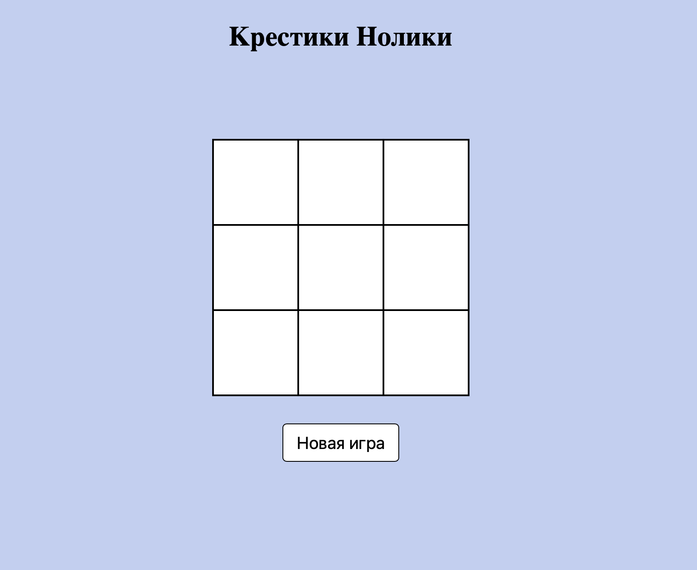
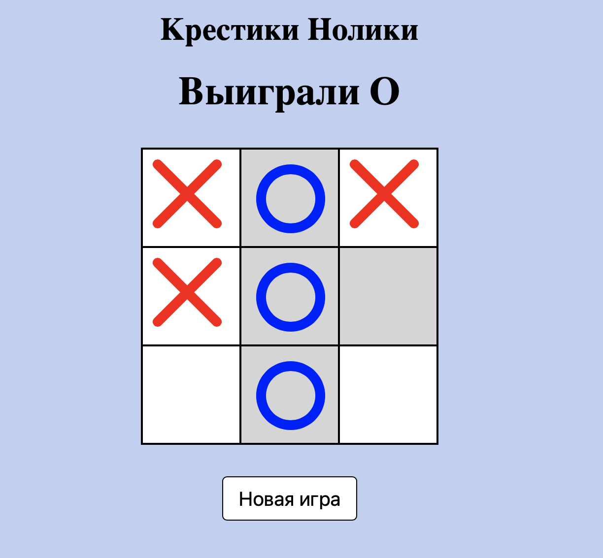

# Tic-Tac-Toe
Проект Tic-Tac-Toe - это классическая игра Крестики-нолики на двоих игроков.
Правило одно - выигрывает тот, кто первым составит 3 символа в ряд.

Посмотреть тест игры можно на видео или по ссылке <a href="https://codepen.io/unnastasya/pen/qBKdzMj">Посмотреть</a>
<video>
<source src="video.mp4">
</video>